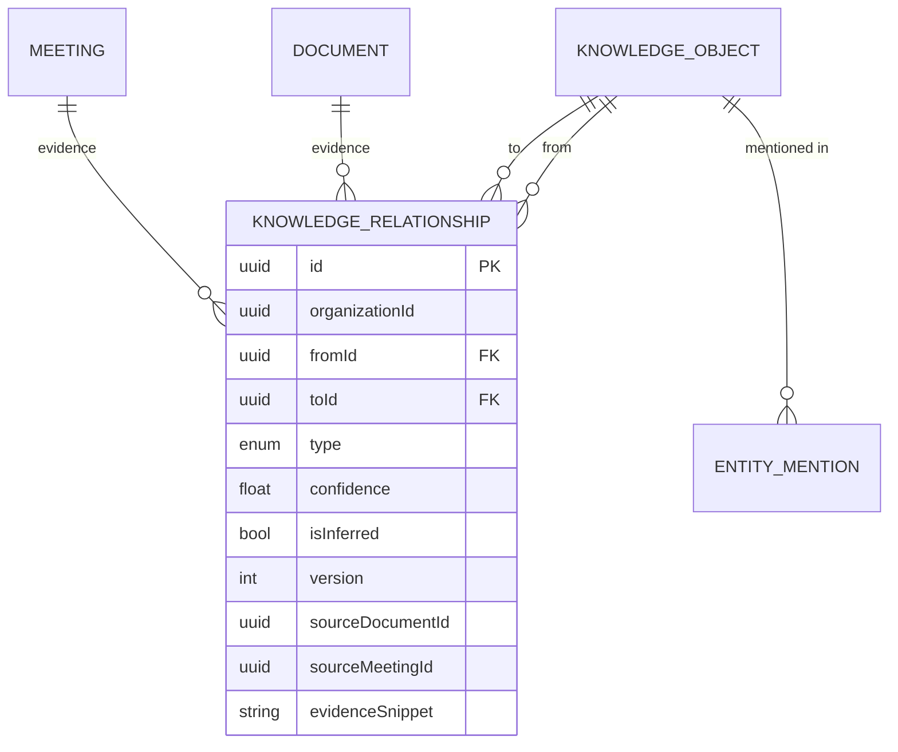

# Knowledge Graph — Relationship Engine (Phase 5)

The Relationship Engine is Company Brain's **semantic backbone**: every
knowledge object automatically connects to every related object, and the graph
continuously evolves as documents, meetings (and future email / GitHub events)
arrive. It is a _queryable_ organizational knowledge graph, not a visualization
feature — the explorer UI is just one consumer of it.

## Relationship model

Edges live in a single table, `knowledge_relationships` (Prisma
`KnowledgeRelationship`), shared by every pipeline. Nodes are `KnowledgeObject`
rows (PERSON, PROJECT, TASK, BUG, DECISION, MEETING, DOCUMENT, …).

| Field                                                                                    | Purpose                                                  |
| ---------------------------------------------------------------------------------------- | -------------------------------------------------------- |
| `id`                                                                                     | Edge id (uuid).                                          |
| `organizationId`                                                                         | Tenant scope (plain scalar).                             |
| `fromId` / `toId`                                                                        | Endpoints (→ `knowledge_objects.id`).                    |
| `type`                                                                                   | `KnowledgeRelationshipType` (45 values).                 |
| `confidence`                                                                             | 0..1 strength of the edge.                               |
| `isInferred`                                                                             | `true` when derived by the inference engine.             |
| `version`                                                                                | Bumped on each reinforcement / update.                   |
| `sourceDocumentId` / `sourceChunkId` / `sourceMeetingId` / `sourceEmailId` / `sourceUrl` | Evidence provenance.                                     |
| `evidenceSnippet` / `transcriptMs`                                                       | Verbatim quote + transcript offset for traceability.     |
| `metadata`                                                                               | Extras (e.g. inference rule + pivot for inferred edges). |

`@@unique([fromId, toId, type])` guarantees a single edge per relation;
re-observing it bumps `version`/`confidence` instead of duplicating.

### ER diagram



### Indexes (scales to millions of edges)

`@@unique([fromId,toId,type])`, `@@index([organizationId,fromId,type])`,
`@@index([organizationId,toId,type])`, `@@index([organizationId,type])`,
`@@index([organizationId,isInferred])`, `@@index([toId])`.

## Architecture

```
Ingestion (document / meeting / …)
  └─ extract KnowledgeObjects + direct edges  ─────────────► knowledge_relationships
        (persist evidence: doc/chunk/meeting id, snippet, transcriptMs)
                              │
                    graphInferenceWorkflow (Temporal)
                              │
             @company-brain/graph  inferEdges()  (2-hop rules)
                              │
        RelationshipService.inferRelationships → isInferred=true edges
                              │
        mergeRelationships (collapse inferred that became direct)
                              │
                 EventBus  relationship.{created,updated,inferred,merged,deleted}
                              │
   GraphService (API)  ── bounded neighborhood load + pure BFS/DFS/shortest-path
                              │
                    /api/v1/graph  ─────────►  Graph Explorer UI
```

- **`packages/graph`** — pure, dependency-free: `bfs` / `dfs` / `shortestPath`
  (with relationship-type / entity-type / confidence / depth / direction
  filters) and the declarative 2-hop `inferEdges` engine. Fully unit-tested.
- **`RelationshipService`** (write) — `packages/activities/src/relationship.activities.ts`:
  `createRelationship` (dedup + version + evidence + events), `updateRelationship`,
  `deleteRelationship`, `mergeRelationships`, `inferRelationships`.
- **`GraphService`** (read) — `apps/api/src/modules/graph/graph.service.ts`:
  `subgraph`, `objectGraph`, `neighbors`, `path`, `relatedObjects`,
  `connectedPeople`, `projectGraph`, `rebuild`.
- **Workflows** — `graphInferenceWorkflow` / `graphRebuildWorkflow`, run as a
  step of the knowledge + meeting pipelines and standalone via `/graph/rebuild`.

## Relationship lifecycle

```
extract ──► create (direct, confidence, evidence)  ──► event: relationship.created
             │
             ├─ re-observed ──► version++ / max(confidence)  ──► relationship.updated
             │
infer  ──► derive 2-hop (isInferred=true)  ──► event: relationship.inferred
             │
merge  ──► inferred duplicated by a direct edge → soft-deleted ──► relationship.merged
             │
delete ──► soft-delete (deletedAt)  ──► event: relationship.deleted
```

## Inference rules (config-driven)

Straight 2-hop composition `A --first--> B --second--> C ⇒ A --then--> C`,
confidence `c1 × c2 × factor`. Defaults in `packages/graph/src/config.ts`
(override via env / `resolveGraphConfig`). Examples:

| first         | second       | ⇒ then       | meaning                                               |
| ------------- | ------------ | ------------ | ----------------------------------------------------- |
| `REFERENCES`  | `BELONGS_TO` | `RELATED_TO` | Meeting references Bug in Project ⇒ Meeting ↔ Project |
| `ASSIGNED_TO` | `PART_OF`    | `WORKS_ON`   | Person owns Task in Project ⇒ Person works on Project |
| `PART_OF`     | `PART_OF`    | `PART_OF`    | transitive containment                                |
| `FIXES`       | `AFFECTS`    | `AFFECTS`    | a fix inherits the bug's blast radius                 |

## API

| Method | Path                          | Description                                 |
| ------ | ----------------------------- | ------------------------------------------- |
| GET    | `/api/v1/graph`               | Org subgraph (or neighborhood of `rootId`). |
| GET    | `/api/v1/graph/object/:id`    | Node + edges + **evidence**.                |
| GET    | `/api/v1/graph/neighbors/:id` | Neighbors within N hops (filters).          |
| GET    | `/api/v1/graph/path`          | Shortest path `?from=&to=`.                 |
| GET    | `/api/v1/graph/search`        | Hybrid entity search.                       |
| GET    | `/api/v1/graph/people/:id`    | People connected to an entity.              |
| GET    | `/api/v1/graph/project/:id`   | Project subgraph.                           |
| POST   | `/api/v1/graph/rebuild`       | Re-infer + merge across the org.            |

Every edge query is organization-isolated and bounded by the graph config
(depth + node caps), with relationship-type / confidence filters pushed to SQL.

## Traversal + query examples

```
# Everything related to Stripe (2 hops around the Stripe node)
GET /api/v1/graph/neighbors/<stripeId>?depth=2

# Everyone working on Project Atlas
GET /api/v1/graph/people/<atlasId>

# All meetings that mention Bug 124 → filter neighbors by relationship type
GET /api/v1/graph/neighbors/<bug124Id>?relationshipTypes=REFERENCES,DISCUSSED_IN&entityTypes=MEETING

# How is a decision connected to a customer?
GET /api/v1/graph/path?from=<decisionId>&to=<customerId>
```

Programmatic (pure package):

```ts
import {
  buildAdjacency,
  bfs,
  shortestPath,
  inferEdges,
  resolveGraphConfig,
} from '@company-brain/graph';

const adj = buildAdjacency(edges, 'both', { maxDepth: 3, minConfidence: 0.3 });
const reachable = bfs(adj, rootId, { maxDepth: 3 });
const path = shortestPath(adj, fromId, toId, { maxDepth: 6 });
const inferred = inferEdges(edges, resolveGraphConfig());
```

## Events

`relationship.created | updated | deleted | merged | inferred` are published on
the Redis `EventBus` (`brain:events` channel + stream) with a
`RelationshipEventPayload` (`relationshipId`, `fromId`, `toId`,
`relationshipType`, `confidence`, `isInferred`). Consumers subscribe with
`XREADGROUP`; nothing polls the database.
